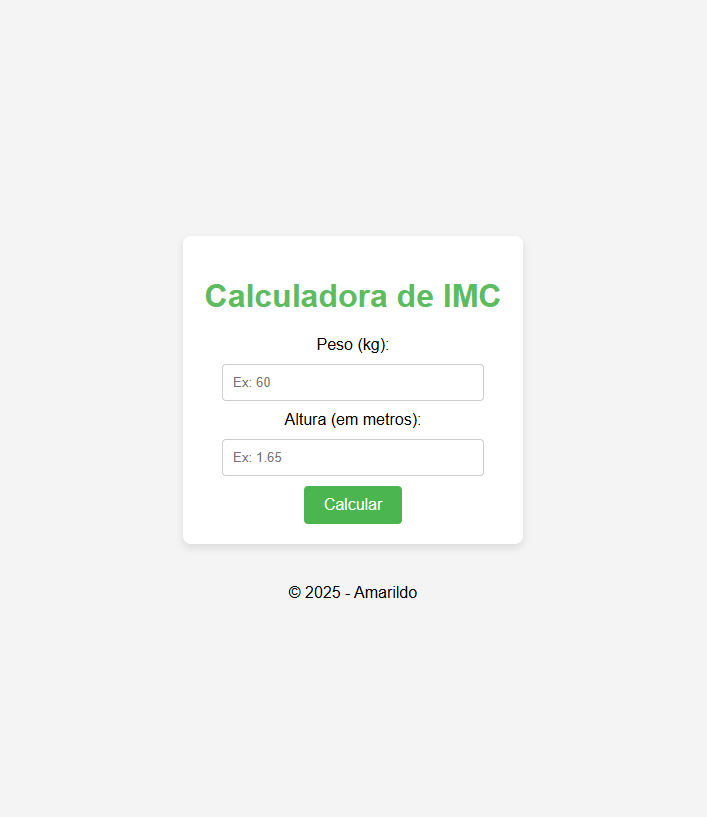
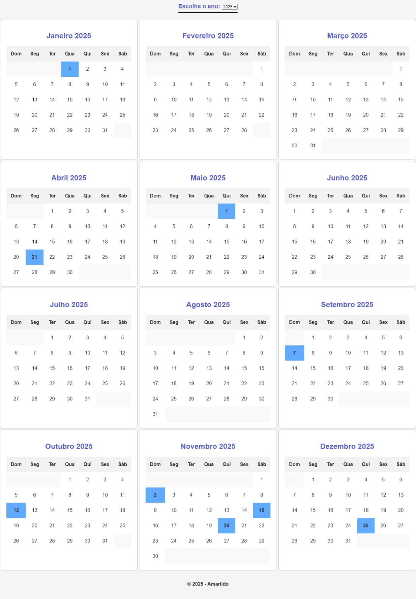

#### Desenvolvimento de Sistemas com PHP

Prática 1: [Calculadora de IMC:](https://github.com/Amarildop1/DesenvolvimentoDeSistemasComPHP/tree/main/pratica1)

 

Prática 2: [Calendário Anual:](https://github.com/Amarildop1/DesenvolvimentoDeSistemasComPHP/tree/main/pratica2)

 

Prática 3: [Cantina Italiana:](https://github.com/Amarildop1/DesenvolvimentoDeSistemasComPHP/tree/main/pratica3)

 

 

